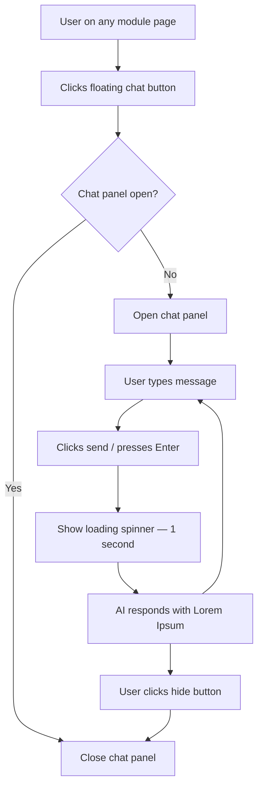
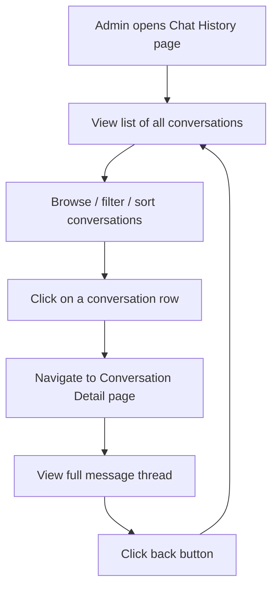
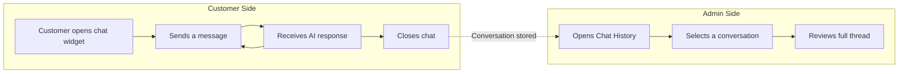

# AI Support Chat

## Overview
An AI-powered customer support chat system with two main areas: a global floating chat widget available on every page within the module, and an admin-facing chat history dashboard for reviewing customer conversations.

## User Flows

### Chat Widget Flow

### Admin Chat History Flow

### End-to-End Customer Support Flow

## Pages

### Chat History (default)
- Table/list view showing all customer chat sessions
- Each row displays: customer name/ID, chat subject or first message preview, date/time, message count, status (active/closed)
- Clicking a row navigates to the full conversation detail page
- Sortable and filterable by date, status, customer

### Conversation Detail
- Full conversation thread for a selected chat session
- Header with back button, customer name, chat metadata (date, status)
- Messages displayed in chronological order with clear visual distinction between customer messages (left-aligned) and AI responses (right-aligned)
- Timestamps on each message
- Read-only view — admin cannot send messages here

## Global Chat Widget

### Floating Action Button
- Persistent button visible on all pages within the module (bottom-right corner)
- Clicking toggles the chat panel open/closed
- Visual indicator (icon change or badge) when chat is open vs closed

### Chat Panel
- Slides in or overlays from the bottom-right when opened
- **Header**: title ("AI Support") and a hide/close button to collapse the panel
- **Message area**: scrollable container showing the conversation history between the user and AI
  - User messages styled distinctly (e.g., right-aligned, colored bubble)
  - AI responses styled differently (e.g., left-aligned, neutral bubble)
  - Auto-scrolls to the latest message
- **Input area**: text input field with a send button
  - Send on button click or Enter key press
  - Input clears after sending

### AI Response Behavior (Prototype)
- When the user sends a message, a loading spinner appears for **1 second**
- After the spinner, the AI responds with a **Lorem Ipsum** paragraph
- Every message from the AI is Lorem Ipsum — this is a prototype, not a real AI integration

## Interactions
- Floating button toggles chat panel open/closed
- Sending a message shows a 1-second spinner, then a Lorem Ipsum AI reply
- Chat history table rows are clickable, navigating to conversation detail
- Back button on conversation detail returns to chat history list
- Chat panel persists across page navigation within the module

## Data
All data is static mock data defined in the `data/` folder:
- Pre-populated chat history list with ~6-8 sample conversations
- Each conversation contains 4-8 messages alternating between customer and AI
- AI messages use Lorem Ipsum text
- Customer messages use realistic support-style questions
